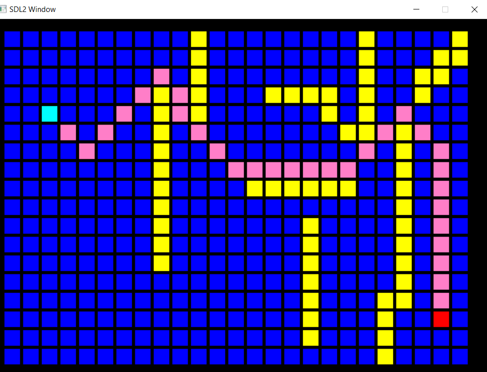

# ASTAR ALGORITHM

This projects demonstrates the implementation of astar algorithm in a given 2D Array.

Controls: -
A - To select source
S - To select destination
D - To make obstacles
F - To make a block normal again
C - Calculate Path
R - Reset
